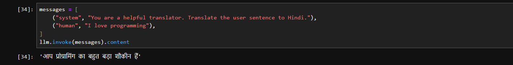
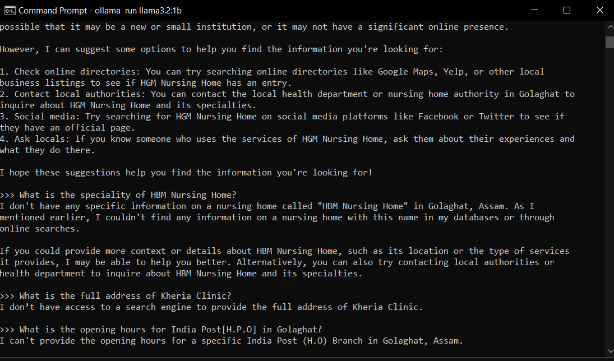
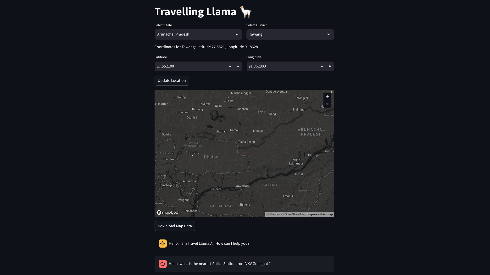
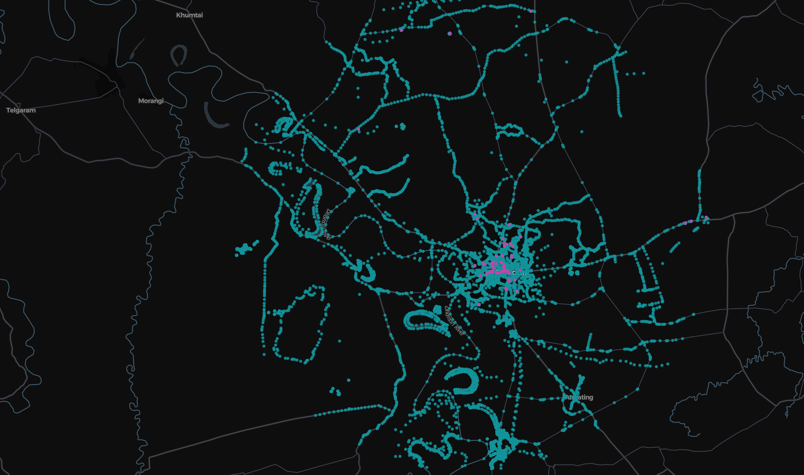

# AI Hackathon with Meta Llama 🦙


## Wander Llama 🦙:


<p align="justify">

<b>Theme </b>: AI on Edge - Develop AI solutions optimised for edge devices, ensuring real-time processing without cloud reliance.

Team Name: Travelling Llama
</p>

### Problem:

<p align="justify">
Travelers in remote areas, such as hikers, or people living in regions with limited or no regular internet connectivity, often struggle to access real-time travel information like route suggestions, locality information from locals, weather updates, or local cultural knowledge. This issue is even more critical during natural disasters, when internet infrastructure may fail entirely, leaving people without access to vital information. Traditional travel apps, which depend on cloud services, become unusable without a stable internet connection and may compromise user privacy.
</p>

### Solution:

<p align="justify">
Travelling Llama is an offline, edge-powered travel companion app that provides personalized travel recommendations and real-time information about everything within a 10 km radius of a geolocation, even in areas without internet access. By using Meta’s Llama 3.2 model, optimized for edge devices, the app offers localized route suggestions, locality information from locals, weather forecasts, cultural insights, and safety alerts tailored to individual user preferences. It operates entirely offline, ensuring data privacy through on-device processing. This solution is perfect for hikers, people living in remote areas, and regions affected by natural disasters.
</p>

  

<p align="justify">
We have implemented a Retrieval-Augmented Generation (RAG) pipeline to extract information specific to (example remote location) Golaghat, Assam, allowing us to generate insights beyond the inherent capabilities of the Llama 3.2 1B model. To achieve this, we created a custom GeoJSON dataset for the region and utilized it as contextual input for the model. Additionally, we employed techniques such as Retrieval Question Answering (RetrievalQA) to obtain answers that were otherwise unavailable, thereby enhancing our data retrieval and generation capabilities.
</p>

<p align="justify">

`Key Technologies`: Python, JavaScript, Streamlit, PyTorch, OpenWeatherMap API (weather), Geopandas, OpenStreetMap, Scraping via Selenium, BeautifulSoup4.

`RAG Pipeline`: Langchain, ChromaDb, ChatOllama(model=llama3.2:1b), OllamaEmbedings(nomic-embed-text), Geojson

</p>


## Impact:

### Target Audience:

+ `Hikers and Travelers in Remote Areas`: Ideal for those needing travel information with chat interface within a 10 km radius in regions without internet connectivity.
+ `People Living in Remote Areas`: Provides real-time local information for individuals in places with unreliable or no internet access.
+ `Regions Affected by Natural Disasters`: Delivers essential real-time information, weather alerts, and safety updates when internet services are disrupted due to calamities.


### Benefits:

+ `Increased Safety`: Real-time route suggestions, local information and weather alerts within a 10 km radius, ensuring safer travel decisions, even in hazardous or remote areas.
+ `Enhanced Privacy`: Data remains on the device, protecting user privacy while enabling personalized recommendations and learning without cloud processing.
+ `Uninterrupted Service`: Functions offline, making it ideal for travel in areas without internet access or during natural disasters when communication infrastructure is compromised.
+ `Scalability & Future Plans`:
Travelling Llama can be expanded to additional edge devices (e.g., wearables, smart cars, smart senors and iot systems), and future features such as AR-based navigation for offline route exploration and real-time IoT-based environmental data.



<p align="justify">

`Travelling Llama` offers a groundbreaking travel assistance experience, providing real-time, personalized information within a 10 km radius, even without internet connectivity. By leveraging AI on the edge, it ensures privacy, safety, and accessibility, making it indispensable for travelers, residents of remote areas, and those affected by natural disasters.
</p>

## Implementation : Travelling Llama - Edge AI Travel Companion Using Llama 3.2 with RAG

<p align="justify">
To implement the solution using Meta’s Llama 3.2 1-bit model with 1 billion parameters, we integrate Retrieval-Augmented Generation (RAG) to handle custom queries, improve the personalization of responses, and create an offline travel assistant. 
</p>

CODE : Llama 3.2 ~ 1 bit [ [without_RAG](./without_rag/), [with_RAG](./with_rag/) ]

`Responses from Llama 3.2 1 bit model via ollama` (without RAG): [[without_rag.ipynb](./without_rag/without_rag.ipynb)]




`Responses from Llama 3.2 1 bit model via ollama` (with RAG): [[rag_pipeline.ipynb](./with_rag/rag_pipeline.ipynb)]


## Data Scraping:

</>  

[ Streamlit application : [sapp.py](./sapp.py) ~ to scrape GeoJSON data from 10km radius around a geolocation. Users can use our app to download custom geo location data with landmark information, latitude, longitude of public institutes, hotel information and road network information; Tech Stack : Langchain, ChatGroq(Model=llama-3.1-70b-versatile), streamlit  ]

```python
    $ streamlit run sapp.py
```

Scraped data from OpenStreetMap : [ [map_data.geojson](./map_data.geojson), [map_data_all.geojson](./map_data_all.geojson) ]

```json
        {
            "type": "Feature",
            "properties": {
                "tags": {
                    "addr:city": "Golaghat",
                    "addr:district": "Golaghat",
                    "addr:full": "Jagat Goswami Road",
                    "addr:postcode": "785621",
                    "addr:state": "Assam",
                    "addr:street": "Jagat Goswami Road",
                    "amenity": "hospital",
                    "emergency": "yes",
                    "healthcare": "hospital",
                    "healthcare:speciality": "general",
                    "name": "Lifeline Hospital and Research Centre",
                    "operator:type": "private",
                    "source": "OpenGovernmentData"
                },
                "name": "Lifeline Hospital and Research Centre"
            },
            "geometry": {
                "type": "Point",
                "coordinates": [
                    93.9748279,
                    26.5159925
                ]
            }
```
Interface to Scrape GeoJSON data from OpenStreetMap:



[ [scrape_wiki.py](./scrape_wiki.py) ~ Scrape data from Wikipedia ~ data : [golaghat_full_wikipedia_data.json](./golaghat_full_wikipedia_data.json) ] [ [weather.py](./weather.py) ~ Scrape live weather data from OpenWeatherMap ~ data : [realtime_weather.json](./realtime_weather.json) ] [ [tripadvisor.py](./tripadvisor.py) ~ scrape article data ]

Here is a visualization of data scraped from OpenStreetMap with 10km radius of a geolocation ([map_data_all.geojson](./map_data_all.geojson)):



Custom Datasets:

+ Incorporating satellite data 🛰️, particularly Synthetic Aperture Radar (SAR) data, into our Llama model with Retrieval-Augmented Generation (RAG) can significantly enhance the system’s capabilities for providing real-time alerts and localized information for outdoor activities like hiking. This approach allows us to create a robust, custom dataset that facilitates the generation of geo-relevant alerts, such as flood warnings, and enriches the geographical context with details about hiking trails, forest areas, and more.

+ For the Llama model, a custom dataset was created to implement the RAG approach. It helps to look at the location from a local's perspective and offers a unique opportunity to harness community knowledge and localized data. This custom dataset not only enhances the accuracy of responses but also ensures that the information provided is relevant, culturally sensitive, and grounded in the real experiences of the local population.

